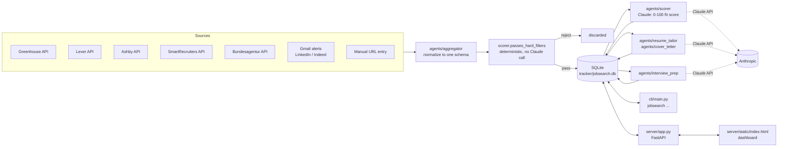
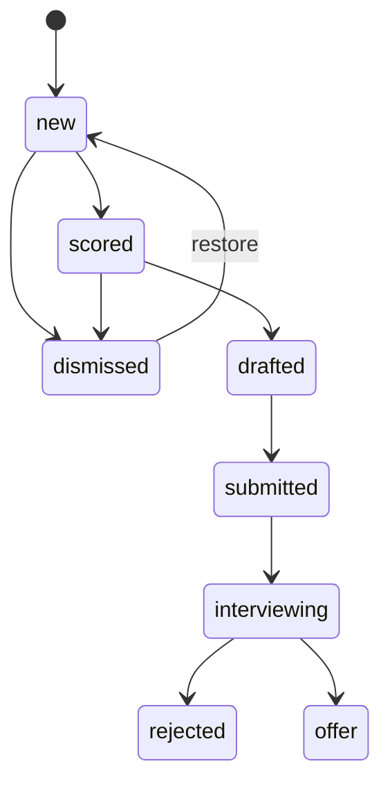

# Architecture

This is the technical reference for how job-search-agent is put together: data flow, module
responsibilities, the database schema, agent contracts, and the CLI/API surface. For the project's
goals and conventions, see `CLAUDE.md`. For install/setup steps, see `README.md`.

## System overview



Everything downstream of "discarded" is a human-in-the-loop step. The system never posts to a job
board or submits a form; every write to a job board happens in the candidate's own browser.

## Pipeline stages

1. **Aggregate** (`agents/aggregator`) — pulls postings from every configured source and normalizes
   them into one schema (below). A posting's `id` is a 12-hex-char sha1 of `source + url`, so the
   same posting fetched twice never double-inserts.
2. **Hard filter** (`agents/scorer.passes_hard_filters`) — cheap, deterministic, no API call. Drops
   postings that can't possibly fit (excluded company, excluded title keyword, wrong location,
   wrong language) before anything reaches Claude. Only postings that pass are written to the DB
   at all, so "postings that failed the hard filter" leaves no trace — this keeps the DB free of
   noise you're not going to look at anyway.
3. **Score** (`agents/scorer.score_posting` / `score_all`) — one Claude call per posting, returns
   an integer 0-100 and a one-paragraph rationale. A deterministic adjustment is layered on top of
   the raw Claude score afterward (see "Scoring adjustments" below), and every job — above or below
   the threshold — is written back with status `scored`, so nothing is silently dropped at this
   stage; the dashboard just defaults to hiding below-threshold jobs.
4. **Draft** (`agents/resume_tailor`, `agents/cover_letter`) — two Claude calls that produce a
   tailored resume and cover letter for a specific posting. Both agents are hard-constrained to
   never invent experience; tailoring means re-ordering and re-emphasizing what's already in the
   base resume/profile, not adding to it.
5. **Track** (`tracker`) — the SQLite `jobs` table is the single source of truth for where each
   application stands. Status transitions are written through `update_status`, which also appends
   an `activity_log` row.
6. **Prep** (`agents/interview_prep`) — once a job's status becomes `interviewing`, one more Claude
   call produces a company brief, likely questions, and talking points tied to the candidate's
   actual background.

Steps 3-6 are exposed identically through `cli/main.py` and `server/app.py` — the CLI and the
dashboard are two front ends over the same `tracker` functions and the same agent modules. Neither
one contains pipeline logic of its own.

## Module reference

| Path | Responsibility |
|---|---|
| `agents/aggregator/` | Fetches and normalizes postings from every source into one schema. Also handles best-effort scraping for manually-added URLs (`fetch_manual_url`, `normalize_manual_posting`). |
| `agents/scorer/` | `passes_hard_filters` (deterministic pre-filter), `score_posting`/`score_all` (Claude scoring + Bay Area/seniority adjustment), `reapply_adjustments` (re-derive adjusted scores without a Claude call, used by `jobsearch readjust` after the adjustment logic itself changes). |
| `agents/resume_tailor/` | `tailor_resume` (initial draft), `revise_resume` (chat-based iteration on an existing draft). |
| `agents/cover_letter/` | `draft_cover_letter`, `revise_cover_letter` — same shape as resume_tailor. |
| `agents/interview_prep/` | `generate_prep_brief` — company brief + likely questions + talking points. |
| `agents/claude_client.py` | Single shared Anthropic client wrapper. All agents call `complete()` through here rather than instantiating their own client, so model choice, pricing, and the `<reply>/<draft>` chat-response parsing convention live in one place. |
| `tracker/` | SQLite schema (`jobs`, `activity_log`) and every read/write function against it. The only module allowed to open a connection to `jobsearch.db`. |
| `server/app.py` | FastAPI app. Thin — every handler calls into `tracker` and `agents/*`; no business logic lives here beyond request/response shaping and a background thread for long-running scoring runs. |
| `server/static/index.html` | The entire dashboard: markup, styles, and vanilla JS in one file, talking to `server/app.py` over `fetch()`. No build step. |
| `cli/main.py` | `click`-based CLI. Same relationship to `tracker`/`agents` as the server: no logic of its own. |
| `data/profile/` | `profile.json` (candidate profile, scored against) and `resume.txt` (base resume, tailored from). Both are inputs you own and edit directly, not generated by the system, and both are gitignored — created locally from the checked-in `profile.example.json` / `resume.example.txt` templates. |
| `data/jobs/latest.json` | Cache of the most recent aggregator run's raw output, for debugging a scan without hitting every source again. Gitignored. |

## Data model

`tracker/jobsearch.db`, created and migrated automatically on first run (`init_db()`).

### `jobs`

The source of truth for every posting the system has seen (that passed the hard filter) and every
application's state.

| Column | Notes |
|---|---|
| `id` | Primary key, `sha1(source + url)[:12]` |
| `source` | `greenhouse` \| `lever` \| `ashby` \| `smartrecruiters` \| `arbeitsagentur` \| `linkedin_email` \| `indeed_email` \| `manual` |
| `title`, `company`, `location`, `url`, `description` | Normalized posting fields |
| `posted_date`, `fetched_date` | ISO 8601 |
| `fit_score`, `fit_rationale` | Set by the scorer; `fit_score` includes the Bay Area/seniority adjustment |
| `status` | `new` → `scored` → `drafted` → `submitted` → `interviewing` → `rejected` \| `offer`, or `dismissed` at any point |
| `resume_draft`, `cover_letter_draft` | Current draft text, editable in place |
| `resume_chat`, `cover_letter_chat` | JSON array of `{role, content, created_at}` — the iteration history behind each draft |
| `prep_brief` | Set once, when status reaches `interviewing` |
| `last_updated` | Bumped on most writes; status changes to `dismissed` are the one exception (see `tracker.update_status`), so a dismiss doesn't push a job to the top of anything sorted by recency |

### `activity_log`

Append-only. Every pipeline action writes one row here — `event_type` is one of `status_change`,
`draft_generated`, `draft_revised`, `scan_run`, `manual_job_added`, `description_edited`,
`score_run`, `prep_generated`. `detail` is a JSON blob; entries that represent a Claude call include
`input_tokens`, `output_tokens`, and `model`, which is what `tracker.get_token_summary()` aggregates
for the dashboard's budget widget.

### Status state machine



Statuses are advisory, not enforced as a strict machine — the dashboard's status dropdown lets you
jump to any value in `tracker.VALID_STATUSES` directly, since real applications don't always move
forward in a straight line (a company can reject you and then re-open contact, a draft can need a
redo, etc).

## Agent contracts

Every agent module follows the same shape: plain functions that take plain dicts in, return
`(text, usage)` or `(reply, revised_text, usage)` out, and never touch the database or the network
except through `agents/claude_client.py`. This is what makes each one independently testable — see
`tests/test_scorer.py`, `tests/test_resume_tailor.py`, `tests/test_cover_letter.py`.

- **Aggregator normalized posting schema** — every source, however different its native API, is
  reduced to `{id, source, title, company, location, url, description, posted_date, fetched_date}`
  before it touches anything else in the system.
- **Scorer** — `passes_hard_filters(posting, profile) -> bool` is pure and synchronous. `score_all`
  additionally applies two deterministic adjustments on top of Claude's raw score: a +8 point boost
  for Bay Area locations, and a 10-15 point penalty for manager-level (not director+) titles located
  outside the Bay Area, since those rarely clear the candidate's comp floor without a relocation
  premium. `reapply_adjustments` strips and reapplies these adjustments from already-scored jobs
  without another Claude call, for when the adjustment thresholds themselves change.
- **Resume tailor / cover letter** — hard constraint enforced in the prompt: never invent a skill,
  title, or achievement not already present in the base resume/profile. `revise_*` takes the current
  draft plus a free-text instruction and returns a `<reply>` (shown in the chat panel) and a
  `<draft>` (replaces the stored draft) via `claude_client.parse_reply_and_draft`.
- **Interview prep** — takes an optional `company_context` string (e.g. fresh web search results)
  the caller can supply; without it, the prompt explicitly tells Claude its knowledge may be stale
  rather than letting it guess silently.

All agent prompts share one house style rule: no hyphens or semicolons in generated text. This is
enforced in the prompt, not post-processed.

## Server / API

`server/app.py`, mounted at `server/static/` for the dashboard's assets.

| Endpoint | Purpose |
|---|---|
| `GET /api/stats` | Counts per status, for the pipeline view |
| `GET /api/jobs`, `GET /api/jobs/{id}` | List / fetch |
| `POST /api/jobs/{id}/status` | Status transition |
| `POST /api/jobs/{id}/description` | Manually set/replace a posting's description (needed for sources like Indeed alert emails that rarely carry a full description) |
| `POST /api/jobs/{id}/draft` | Manual edits to resume/cover letter draft text |
| `GET/POST/DELETE /api/jobs/{id}/chat/{section}` | Chat-based draft iteration (`section` is `resume` or `cover_letter`) |
| `GET /api/jobs/{id}/resume-diff` | Line-level diff of base resume vs. tailored draft, with a similarity threshold to suppress noise from minor rewording |
| `POST /api/scan` | Runs the aggregator + hard filter, stores what's new |
| `POST /api/jobs/manual/fetch` | Best-effort scrape of a pasted URL, to pre-fill the add-job form |
| `POST /api/jobs/manual` | Add a single posting by URL, skipping the hard filter |
| `GET /api/score/estimate` | Estimated Claude cost to score all `new` jobs |
| `POST /api/score`, `GET /api/score/progress`, `POST /api/score/stop` | Scoring runs in a background thread; progress is polled, and stop is cooperative (finishes the in-flight job, then halts) |
| `POST /api/jobs/{id}/generate-draft` | Draft generation; refuses if a draft already exists (409) rather than silently overwriting one |
| `POST /api/jobs/{id}/generate-prep` | Prep brief generation; requires `interviewing` status |
| `GET /api/activity`, `GET /api/token-summary` | Activity feed and budget widget data |

The dashboard (`index.html`) is three views — Pipeline (stats, scan/score actions, budget widget),
All Jobs (filterable list), Activity (log feed) — plus a per-job detail panel reachable from either
list view. It's a single static file with no build step: vanilla JS, `fetch()` against the API
above, re-rendered on state change.

## CLI

`cli/main.py`, installed as `jobsearch` via the `console_scripts` entry point in `pyproject.toml`.
Every command is a thin wrapper calling the same `tracker`/`agents` functions the server uses.

| Command | Equivalent to |
|---|---|
| `jobsearch scan` | `POST /api/scan` |
| `jobsearch score [--limit N]` | `POST /api/score`, but synchronous and uncapped by default |
| `jobsearch list [--status]` | `GET /api/jobs` |
| `jobsearch draft <job_id>` | `POST /api/jobs/{id}/generate-draft` |
| `jobsearch track <job_id> <status>` | `POST /api/jobs/{id}/status` |
| `jobsearch prep <job_id>` | `POST /api/jobs/{id}/generate-prep` |
| `jobsearch readjust` | No API equivalent — recomputes score adjustments over already-scored jobs without calling Claude |
| `jobsearch serve [--host] [--port] [--reload]` | Starts the dashboard |

## Configuration reference

All configuration is environment variables, loaded from `.env` via `python-dotenv`. See
`.env.example` for the authoritative list; every source-specific variable is optional and simply
causes `aggregator.run_all()` to skip that source when unset.

## Design decisions worth knowing

- **Deterministic work stays out of Claude.** Parsing, API calls, DB writes, the hard filter, and
  the Bay Area/seniority score adjustment are all plain Python. Claude is called only where the task
  genuinely needs language judgment: the fit rationale, tailoring, drafting, prep. This keeps most
  of the system free of charge and fast, and keeps the parts that do call Claude easy to reason
  about in isolation.
- **No auto-submit, anywhere.** Drafts are written to the DB and rendered in the dashboard for the
  candidate to review, edit, and submit by hand on the company's own site. This is a hard boundary,
  not a missing feature — automating submission would violate LinkedIn/Indeed terms of service and
  risk account bans.
- **Dedup is source-and-recency aware, not just ID-based** (`tracker.get_scan_dedup_keys`). Besides
  exact ID/URL matches, a `(title, company, source)` tuple seen within the last 30 days also blocks
  re-import — this catches the same role reposted under a fresh listing ID, which is common on
  LinkedIn.
- **Every agent module is independently swappable.** Each one has a narrow input/output contract
  (plain dicts and strings in, text and token usage out) and no dependency on `tracker` or the web
  layer. A new drafting strategy or a different model for one step only touches that one module.

## Extending the system

- **New posting source**: add a fetch function to `agents/aggregator/__init__.py` that returns a
  list of postings in the normalized schema, wire it into `run_all()`, and document its env vars in
  `.env.example`. Nothing downstream needs to change — the hard filter, scorer, and tracker all
  operate on the normalized schema, not on source-specific fields.
- **New agent (e.g. a different drafting step)**: add a module under `agents/` following the
  existing input/output contract, call it from both `cli/main.py` and `server/app.py`, and add a
  column to the `jobs` table via `tracker._migrate_schema` if it needs persistent storage.
- **New CLI command or API endpoint**: same rule as above — the handler should be a thin wrapper
  around `tracker`/`agents` functions, not a new place for logic to live.

## Testing

```bash
pytest
```

Tests are organized one file per module (`tests/test_aggregator.py`, `test_scorer.py`,
`test_resume_tailor.py`, `test_cover_letter.py`, `test_tracker.py`, `test_claude_client.py`) and
mock the Anthropic client rather than calling the real API, so the suite runs without an API key or
network access.
